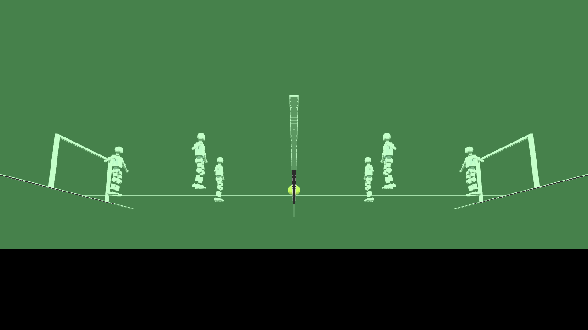
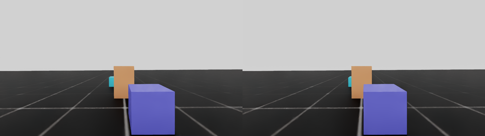
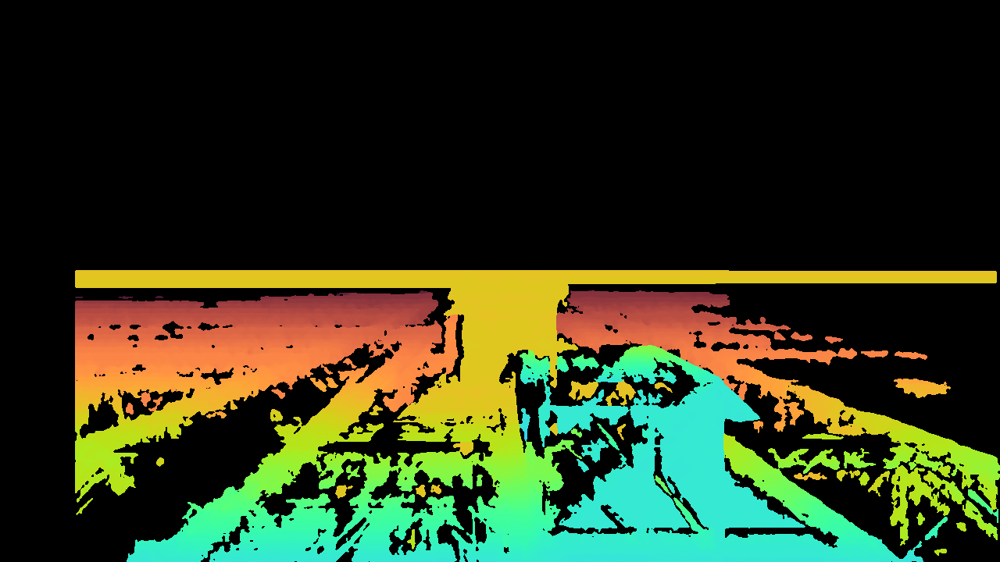
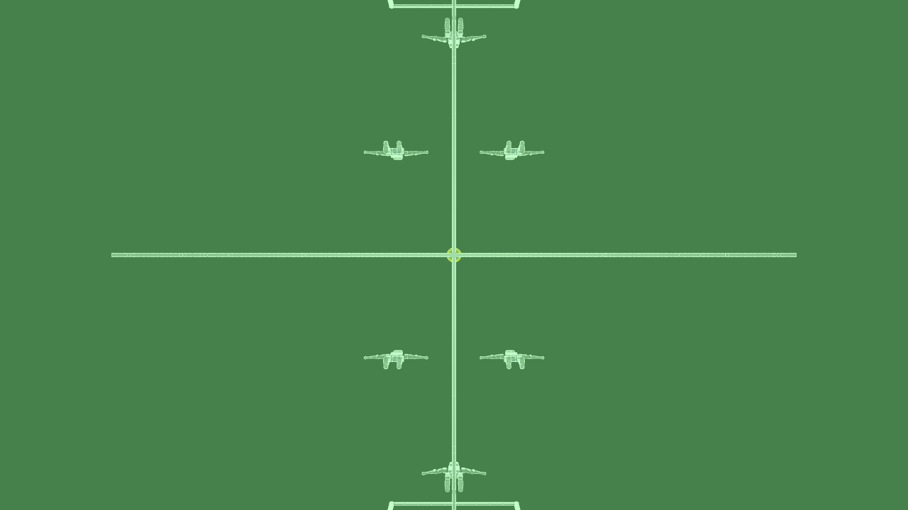
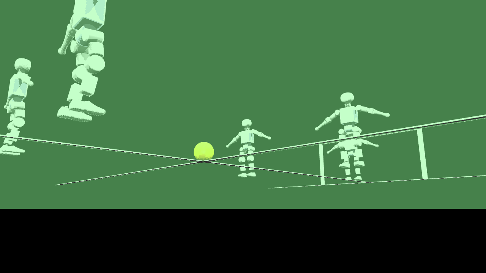

# Booster K1 ROS2 Workspace

Multi-robot simulation, locomotion training, and perception for the Booster
Robotics **K1** humanoid (22 DoF) — ROS 2 Jazzy + Isaac Sim 6.0.1 / Isaac Lab
3.0 + Gazebo Harmonic + MuJoCo.



## Status snapshot

| Area | State |
|---|---|
| Velocity locomotion policy | **Trained** (5000 iters, blind/contact-free) — `models/k1_velocity_policy.pt` (TorchScript) |
| Fleet sim, namespaced endpoints | **Verified on 3 backends**: Gazebo Harmonic, MuJoCo, Isaac Sim |
| Stereo head (ZED 2i replica) | Working in Isaac Sim: ±60 mm baseline, HD720, HFOV 101°, SGBM disparity |
| RoboCup 3v3 field demo | MuJoCo: 6 K1s + goals + ball + scripted kick, image capture |
| Multi-robot Isaac fleet | `fleet_sim.py` — bundled-jazzy rclpy, cross-stack DDS verified |

## Repo layout

```
src/
  k1_interfaces     msgs: JointCommand, LocomotionCommand, RobotStatus, PolicyObs
  k1_description    K1 URDF/xacro + gz_ros2_control blocks + booster_assets submodule
  k1_control        sim_bridge (JointCommand -> controllers), sdk_bridge stub
  k1_sim_gazebo     Gazebo fleet launch, MuJoCo fleet + RoboCup demo scripts
  k1_sim_isaac      Isaac fleet + ZED stereo capture scripts
  k1_locomotion     policy deployment node (Phase 4)
isaac_tasks/
  k1_velocity       RSL-RL velocity task (Isaac-Velocity-Rough-K1-v0) + train/play
  booster_train_ref Booster upstream training reference (submodule)
sdk/                booster_robotics_sdk (read-only submodule)
models/             trained policies (Git LFS)
docs/               research notes + captured imagery
```

## Quick start

### Gazebo Harmonic fleet (CPU)
```bash
source /opt/ros/jazzy/setup.bash && source install/setup.bash
ros2 launch k1_sim_gazebo sim_gazebo_fleet.launch.py n_robots:=2 gui:=false
# endpoints per robot:
#   /k1_{i}/joint_states   /k1_{i}/joint_commands   /k1_{i}/forward_position_controller/commands
```

### MuJoCo fleet / RoboCup demo (CPU)
```bash
source /opt/ros/jazzy/setup.bash && source install/setup.bash
python3 src/k1_sim_gazebo/scripts/mujoco_fleet_node.py --n_robots 3
python3 src/k1_sim_gazebo/scripts/mujoco_robocup_demo.py --capture   # saves docs/images/
```

### Isaac Sim fleet + stereo (GPU)
```bash
/home/thakk100/Projects/IsaacLab/.venv-isaac/bin/python3.12 \
  src/k1_sim_isaac/scripts/fleet_sim.py --n_robots 2 --headless
/home/thakk100/Projects/IsaacLab/.venv-isaac/bin/python3.12 \
  src/k1_sim_isaac/scripts/stereo_cam_test.py --steps 40
```
Isaac fleet uses the **isaacsim-bundled jazzy rclpy** (env re-exec) — never
source `/opt/ros` into that process; system nodes talk to it over DDS
(`ROS_DOMAIN_ID=77`).

## Training

```bash
# train (tmux)
./scripts/start_training.sh
# play + export TorchScript
python isaac_tasks/k1_velocity/scripts/play.py \
  --checkpoint logs/rsl_rl/k1_velocity_rough/<run>/model_4999.pt \
  --num_envs 20 --steps 500 --headless --export models/k1_velocity_policy.pt
```

Result (run `2026-08-24_12-46-29`): mean reward **+12.5**, episode length
**826/1000**, 71% of episodes reach timeout. Blind proprioceptive policy
(contact sensors blocked upstream — see `docs/robocup_gmr_research.md`).

## Stereo head (ZED 2i replica)

K1 ships a Stereolabs **ZED 2i** (120 mm baseline). `stereo_cam_test.py`
mounts two pinhole cameras on `Head_2` (±60 mm, HD720, HFOV 101° = 2.1 mm
lens per Stereolabs' rectified-FOV table) and captures:

| Left / Right | SGBM disparity |
|---|---|
|  |  |

## RoboCup 3v3 (MuJoCo)

| Top | Kick close |
|---|---|
|  |  |

`mujoco_robocup_demo.py` assembles the pitch (markings, goals, ball) and six
K1s via `MjSpec` URDF attach with per-robot name prefixes. Each robot exposes
the standard fleet endpoints; `--capture` runs a scripted striker kick and
saves snapshots. See `docs/robocup_gmr_research.md` for the Booster
`robocup_demo` contract analysis and 3v3 replication plan.

## Docs

- `HANDOFF.md` — environment setup, current state, next steps
- `docs/robocup_gmr_research.md` — RoboCup sim research + GMR (video→motion)
  pipeline integration plan
- `TASKS.md` — phase checklist
