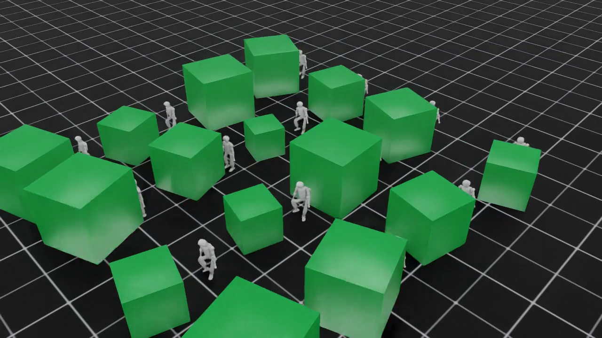
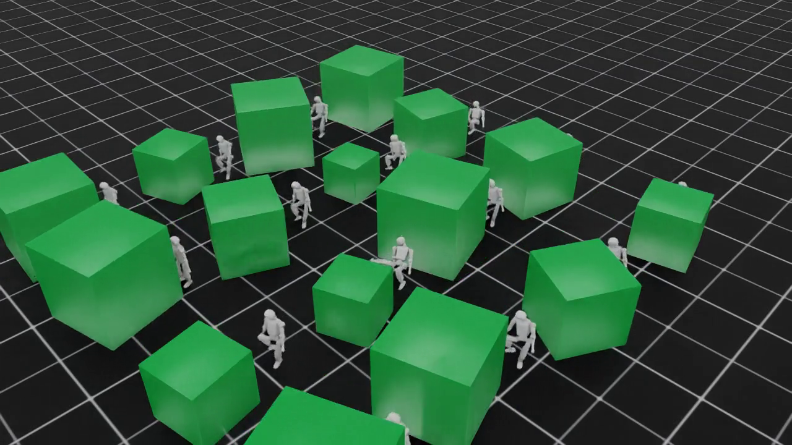

# K1 Locomotion Task Suite

RSL-RL training tasks for the Booster K1 humanoid (22 DoF: 12 leg + 8 arm + 2
head) in Isaac Lab 3.0. Four task families live under
`source/k1_velocity/tasks/`:

| Family | Purpose | Gym ids (teacher → deployable) | Obs (deployable) | Action |
|---|---|---|---|---|
| [**P1 basic**](#p1-basic-standbalance) | stand/balance base layer | `Isaac-Basic-Teacher-K1-v0` → `Isaac-Basic-Student-K1-v0` | 42 blind | 12 legs |
| [**P1f**](#p1f--p1--force-torque-shoves) | P1 + native force/torque shoves | `Isaac-Basic-Teacher-K1-F-v0` → `Isaac-Basic-Student-K1-F-v0` | 42 blind | 12 legs |
| [**P2 velocity**](#p2-velocity-rough-terrain) | velocity tracking on rough terrain | `Isaac-Velocity-Rough-K1-Teacher-v0` → `Isaac-Velocity-Distill-K1-Play-v0` | 48 blind | 12 legs |
| [**P2f**](#p2f--p2--force-torque-shoves) | P2 + native force/torque shoves | `Isaac-Velocity-Rough-K1-Teacher-F-v0` → `Isaac-Velocity-Distill-K1-F-v0` | 48 blind | 12 legs |
| [**Partial control**](#partial-control-leghead-randomized-arms) | legs+head policy, arms randomized outside the action space | `Isaac-Velocity-PartialCtrl-K1-v0` → `…-Play-v0` | 68 blind | 14 (12 legs + 2 head) |
| [**Kick ball**](#kick-ball) | locomotion + ball manipulation (gated) | `Isaac-Kick-Ball-K1-Teacher-v0` → `Isaac-Kick-Ball-K1-Distill-v0` | 45 blind | 12 legs |
| [**P6 push**](#p6-push-box-pushing) | box pushing, frozen base + wrist IK (teacher-only) | `Isaac-Push-Reach-K1-v0` → `Isaac-Push-K1-v0` | 108 privileged | 9 (3 vel + 6 wrist) |

**Teacher → student pattern.** Every family trains a privileged *teacher* with
PPO (sees the 187-point height scan — plus ball state / foot slip / shove wrench
where applicable) and distills a blind *student* that sees proprioception only,
so the TorchScript export deploys on the real robot with no terrain sensing.
`tests/test_deployability.py` statically enforces that deployable observation
groups are GT-free (teacher groups are exempt).

## Platform

- **Robot:** Booster K1 via `booster_train`'s `BOOSTER_K1_CFG` — delayed-PD
  actuators (2–8 sim-step delay), per-joint effort/velocity limits.
- **Framework:** Isaac Lab 3.0 (`nvcr.io/nvidia/isaac-lab:3.0.0-beta2-post1`
  container on the aarch64 sparks; EA layout fallbacks in the `try:` imports) +
  the RSL-RL fork shipped in [`booster_train_ref`](../booster_train_ref/README.md).
- **Physics backend:** PhysX by default (`K1_PHYSICS=physx|newton`, applied in
  each env cfg's `__post_init__` via `k1_velocity/sim_backend.py`).
- **Registration:** `tasks/__init__.py` imports `velocity`, `basic`, `kick`
  (so a plain `import k1_velocity.tasks.velocity` registers them all);
  `partial` registers via explicit import in the train/play scripts.
- **Sensors:** ray-cast height scanner (17×11 = **187** points, 0.1 m grid,
  teacher-only) + contact sensor (foot forces for rewards).

---

## P1 basic (stand/balance)

Stand upright and hold still on rough terrain while shoves hit the robot — the
stability base of the soccer HRL stack (PLAN §4 P1). No velocity commands, no
terrain curriculum; rough-terrain levels are mixed at reset.

### Observations

`policy` group — **42-dim, blind, noise on** (deployable; the distillation env
stacks 10 steps of history → **420** network inputs):

| Term | Function | Dim | Uniform noise |
|---|---|---|---|
| `projected_gravity` | `mdp.projected_gravity` | 3 | ±0.05 |
| `base_ang_vel` | `mdp.base_ang_vel` | 3 | ±0.2 |
| `joint_pos` (12 legs) | `mdp.joint_pos_rel` | 12 | ±0.01 rad |
| `joint_vel` (12 legs) | `mdp.joint_vel_rel` | 12 | ±1.5 rad/s |
| `actions` (last action) | `mdp.last_action` | 12 | — |
| **Total** | | **42** | |

`teacher` group — **233-dim, privileged, noise off** (PPO run only):

| Term | Dim | Notes |
|---|---|---|
| same 5 base terms as `policy` (noise-free) | 42 | |
| `height_scan` | 187 | ray grid 17×11, clipped ±1 m |
| `foot_contact_slip` | 4 | per-foot contact force + slip velocity |
| **Total** | **233** | |

### Actions

| Term | Joints | Dim | Scale |
|---|---|---|---|
| `joint_pos` (`JointPositionActionCfg`) | 12 leg joints | 12 | 0.25 rad offset from default |

### Rewards (locked 9-term P1 table, PLAN §4)

| # | Term | Weight | Meaning |
|---|---|---|---|
| R1 | `flat_orientation_l2` | −1.0 | stand upright |
| R2 | `still_lin_vel` | −1.0 | stay put (linear) |
| R3 | `still_ang_vel` | −0.5 | stay put (angular) |
| R4 | `joint_deviation_default` | −0.5 | hold default 12-leg stance |
| R5 | `action_rate_l2` | −0.005 | smooth actions |
| R6 | `dof_torques_l2` | −1.5e−7 | torque regularization (legs) |
| R7 | `joint_pos_limits` | −1.0 | stay inside joint limits |
| R8 | `feet_slide` | −0.1 | no foot skating |
| R9 | `termination_penalty` | −200.0 | fall penalty |

**Terminations:** `time_out`, `root_height < 0.35 m`, `|tilt| > 0.8 rad`.
**Events:** `push_robot` velocity impulses (10–15 s), `random_body_push`
custom force impulses 20–80 N on Trunk/upper legs (~3–8 s, 60 % of envs),
`add_base_mass` ±2 kg startup, joint reset scale (0.5, 1.5).

### Checkpoints & video

| Variant | Checkpoint | Export | Video |
|---|---|---|---|
| teacher (PPO) | `logs/rsl_rl/p1_basic_teacher/2026-09-22_13-41-33_p1_basic_teacher/model_6498.pt` | `models/p1_basic_teacher.pt` | [p1_teacher_stand.mp4](videos/p1_teacher_stand.mp4) |
| student (distilled) | `logs/rsl_rl/p1_basic_student/2026-09-23_16-20-36_p1_basic_student/model_1499.pt` | `models/p1_basic_student.pt` | [p1_student_stand.mp4](videos/p1_student_stand.mp4) |


---

## P1f — P1 + force/torque shoves

Isaac Lab's **built-in** `envs.mdp.apply_external_force_torque` event drives a
sustained random wrench on the Trunk; the teacher additionally observes the
applied wrench — *teacher knows the shove, student doesn't*.

| Knob | Value |
|---|---|
| Gym ids | `Isaac-Basic-Teacher-K1-F-v0` → `Isaac-Basic-Student-K1-F-v0` |
| Experiments | `p1f_basic_teacher` → `p1f_basic_student` |
| Event `shove_force_torque` | interval 4–8 s/env, force ±30 N, torque ±10 N·m (world frame), body `Trunk` |
| Teacher obs | 233 + `shove_wrench` 6 = **239** (`shove_mdp.applied_shove_wrench`, reads the `permanent_wrench_composer` buffer) |
| Student obs | unchanged **42** (blind; the wrench knowledge transfers via distillation) |
| Diff vs P1 | P1's custom `random_body_push` is **disabled** — both drive the same permanent-wrench buffer and would clobber each other (one wrench authority per task) |

`ForceEventCfg` / `ForceTeacherCfg` live in `tasks/basic/basic_env_force.py`.

---

## P2 velocity (rough terrain)

Follow `(v_x, v_y, ω_z)` velocity commands over procedurally generated rough
terrain with a terrain-level curriculum.

### Observations

`policy` group — **48-dim, blind, noise on** (distillation env stacks 10 steps
→ **480** inputs; the cfg docstring's "72-dim" predates the blind-policy
change — actual = 48):

| Term | Function | Dim | Uniform noise |
|---|---|---|---|
| `base_lin_vel` | `mdp.base_lin_vel` | 3 | ±0.1 m/s |
| `base_ang_vel` | `mdp.base_ang_vel` | 3 | ±0.2 rad/s |
| `projected_gravity` | `mdp.projected_gravity` | 3 | ±0.05 |
| `velocity_commands` | `mdp.generated_commands` | 3 | — |
| `joint_pos` (12 legs) | `mdp.joint_pos_rel` | 12 | ±0.01 rad |
| `joint_vel` (12 legs) | `mdp.joint_vel_rel` | 12 | ±1.5 rad/s |
| `actions` | `mdp.last_action` | 12 | — |
| **Total** | | **48** | |

`teacher` group — **235-dim, privileged, noise off**: same 7 terms noise-free +
`height_scan` 187.

### Actions

| Term | Joints | Dim | Scale |
|---|---|---|---|
| `joint_pos` | 12 leg joints | 12 | 0.25 rad offset from default |

### Commands

`UniformVelocityCommand` (**gait-v2, 2026-09-24**): direct Cartesian commands
`v_x ∈ [−1.5, 1.5]`, `v_y ∈ [−0.75, 0.75]`, `ω_z ∈ [−1.5, 1.5]` — heading mode
**off** (the old heading-everywhere mode hid the requested ranges and made
lateral commands hard to learn), 5 % standing envs, resample every 8–12 s.
Play/eval cfgs pin a directly expressed `(0.8, 0, 0)` walking command.

### Rewards

**Gait-v2** — H1/G1-style bipedal shaping (reviewed against IsaacLab
`core/velocity` + G1 `rough_env_cfg`; every term verified firing on the
training image via `scripts/reward_probe.sh`, 2026-09-24):

| Term | Weight | Meaning |
|---|---|---|
| `track_lin_vel_xy_exp` | +1.5 | track commanded linear velocity (exp kernel, std² = 0.25) |
| `track_ang_vel_z_exp` | +1.5 | track commanded yaw rate (exp kernel, std² = 0.25) |
| `feet_air_time` | +0.5 | biped gait — single-stance air time, threshold 0.3 s (short K1 steps get signal) |
| `feet_slide` | −0.25 | no foot skating (anti static-slide) |
| `termination_penalty` | −200.0 | fall penalty |
| `lin_vel_z_l2` | −2.0 | no hopping (core default; G1 zeroes it) |
| `ang_vel_xy_l2` | −0.05 | no roll/pitch sway (G1 inherits the same from core) |
| `flat_orientation_l2` | −1.0 | upright torso |
| `action_rate_l2` | −0.01 | smooth actions |
| `dof_acc_l2` | −2.5e−7 | joint acceleration (hips/knees) |
| `dof_torques_l2` | −2.0e−6 | torque regularization (legs) |
| `dof_pos_limits` | −1.0 | ankle limits |
| `joint_deviation_arms` | −0.1 | arms/head near default |
| `stand_still` | −0.5 | near-zero command → hold default pose, don't march in place |
| `undesired_contacts` | −1.0 | Trunk/hip ground contact — no crawling/kneeling to solve velocity |

**Curriculum:** `terrain_levels` (`terrain_levels_vel` — promote envs that
track their terrain level, demote failures; `max_init_terrain_level = 0` so
the gait is learned on the flat curriculum-start tiles first).
**Events:** `push_robot` impulses (10–15 s), `add_base_mass` ±2 kg.
**Terminations:** `time_out`, `root_height < 0.35`, `|tilt| > 0.8`.

### Checkpoints & video

| Variant | Checkpoint | Export | Video |
|---|---|---|---|
| teacher (PPO, rough) | `logs/rsl_rl/k1_velocity_teacher/2026-09-22_13-14-06/model_2999.pt` | `models/p2_move_teacher.pt` | [p2_teacher_rough.mp4](videos/p2_teacher_rough.mp4) |
| student (distilled, flat) | `logs/rsl_rl/p2_move_student/2026-09-23_13-46-54/model_2999.pt` | `models/p2_move_student.pt` | [p2_student_walk.mp4](videos/p2_student_walk.mp4) |


Older rough-era exports (pre-HRL campaign): `models/k1_velocity_teacher_4999.pt`,
`models/k1_velocity_policy.pt`, `models/k1_velocity_student.pt`.

---

## P2f — P2 + force/torque shoves

Same native `apply_external_force_torque` treatment as P1f — this closes the
PLAN §3.2 gap (P2 shipped only velocity impulses + mass randomization).

| Knob | Value |
|---|---|
| Gym ids | `Isaac-Velocity-Rough-K1-Teacher-F-v0` → `Isaac-Velocity-Distill-K1-F-v0` |
| Experiments | `p2f_move_teacher` → `p2f_move_student` |
| Event `shove_force_torque` | interval 4–8 s/env, force ±30 N, torque ±10 N·m, body `Trunk` |
| Teacher obs | 235 + `shove_wrench` 6 = **241** |
| Student obs | unchanged **48** (blind) |

`ForceEventCfg` / `ForceTeacherCfg` live in `tasks/velocity/velocity_force_cfg.py`.

---

## Partial control (legs+head, randomized arms)

A **14-dim policy** (12 legs + 2 head/gaze) balances and tracks velocity while
the 8 arm joints are deliberately *outside* the action space: on every reset
they are placed at a curriculum-scaled random pose and PD-held there, so the
base policy learns to move under **variable arm configurations** — the
precondition for stacking an upper-body controller on top later.

### Observations

`policy` group — **68-dim, blind, noise on** (PPO directly, no history stack):

| Term | Function | Dim | Uniform noise |
|---|---|---|---|
| `base_lin_vel` | `mdp.base_lin_vel` | 3 | ±0.1 |
| `base_ang_vel` | `mdp.base_ang_vel` | 3 | ±0.2 |
| `projected_gravity` | `mdp.projected_gravity` | 3 | ±0.05 |
| `velocity_commands` | `mdp.generated_commands` | 3 | — |
| `joint_pos` (12 legs) | `mdp.joint_pos_rel` | 12 | ±0.01 |
| `joint_vel` (12 legs) | `mdp.joint_vel_rel` | 12 | ±1.5 |
| `joint_pos_head` (2) | `mdp.joint_pos_rel` | 2 | ±0.01 |
| `arm_joint_pos` (8, not controlled) | `mdp.joint_pos_rel` | 8 | ±0.01 |
| `arm_joint_vel` (8) | `mdp.joint_vel_rel` | 8 | ±1.5 |
| `actions` | `mdp.last_action` | 14 | — |
| **Total** | | **68** | |

### Actions

| Term | Joints | Dim | Scale |
|---|---|---|---|
| `joint_pos` | 12 legs | 12 | 0.25 rad |
| `head_pos` | 2 head (`AAHead_yaw`, `Head_pitch`) | 2 | 0.5 rad |

Arms have **no action term** — their actuators chase the episode hold target.

### Rewards

The velocity task's locked set, with `joint_deviation_arms` (deviation from the
*fixed* default pose — would fight the randomization) replaced by:

| Term | Weight | Meaning |
|---|---|---|
| `arm_pose_deviation` | −0.05 | hold arms at the **episode's randomized target** (`joint_deviation_from_target_l1`) |

(inherits the gait-v2 velocity set: `track_lin_vel_xy_exp` +1.5,
`track_ang_vel_z_exp` +1.5, `feet_air_time` +0.5 (thr 0.3),
`feet_slide` −0.25, `termination_penalty` −200, `lin_vel_z_l2` −2.0,
`ang_vel_xy_l2` −0.05, `flat_orientation_l2` −1.0, `action_rate_l2` −0.01,
`dof_acc_l2` −2.5e−7, `dof_torques_l2` −2.0e−6, `dof_pos_limits` −1.0,
`stand_still` −0.5, `undesired_contacts` −1.0.)

### Curricula & events

| Term | Mode | Schedule |
|---|---|---|
| `arm_pose_random` | reset event | random arm pose around default, scale **0.15 → 1.0** over iterations **300 → 2000** (curriculum term `arm_pose`) |
| `arm_delta_change` | interval event (2–5 s) | mid-episode re-target: adds `scale · U(−1,1)` rad to each arm joint's **current** PD target (clamped to soft limits; no-op at scale 0). Curriculum term `arm_delta` ramps scale **0.0 → 1.0** over iterations **600 → 2500** — starts with zero changes, grows as the model improves (added 2026-09-23; **not** in Run-10 checkpoints) |
| `terrain_levels` | terrain curriculum | velocity task's rough-terrain ramp |

Play/eval cfg pins `arm_pose` scale 1.0 (full random poses) and `arm_delta`
scale 0.0 (Run-10 ckpts never saw deltas — raise to 1.0 for Run-11+).

### Runs & video

| Run | Content | Status |
|---|---|---|
| Run-10 | base policy, 512×3000, seed 42, spark02, `k1_partialctrl_base` | training (see [`TRAINING.md`](../../TRAINING.md)) |
| Run-11 | Run-10 + the `arm_delta` mid-episode curriculum | queued behind Run-10 |

Video: [partial_walk.mp4](videos/partial_walk.mp4) (recorded after Run-10
finishes; the play cfg for Run-10 ckpts pins deltas off).

---

## Kick ball

Locomotion + ball manipulation: the policy walks up to / shoots at a ball,
rewarded for scoring in the kinematic goal. Resets sample three OmniReset
families: `at_ball_shoot` 50 %, `stand_ready` 30 %, `walk_up` 20 %.

### Observations

`policy` — **45-dim, blind, noise on**: `base_lin_vel` 3 + `base_ang_vel` 3 +
`projected_gravity` 3 + `joint_pos` 12 + `joint_vel` 12 + `actions` 12.
`teacher` — **≈51-dim, privileged**: the same terms noise-free + `ball_pos`
(robot-frame ball position) + `ball_lin_vel` (robot-frame ball velocity).

### Actions

12 leg joint position targets, scale 0.25 rad.

### Rewards

| Term | Weight | Meaning |
|---|---|---|
| `goal_scored` | +100.0 | sparse primary: ball crosses the goal line (also a termination) |
| `ball_to_goal_progress` | +1.0 | light shaping toward goal |
| `flat_orientation_l2` | −1.0 | upright torso |
| `action_rate_l2` | −0.005 | smooth actions |
| `dof_torques_l2` | −1.5e−7 | torque regularization |
| `dof_pos_limits` | −1.0 | ankle limits |
| `joint_deviation_arms` | −0.05 | arms/head near default |
| `termination_penalty` | −200.0 | fall penalty |

**Status:** ⛔ gated — training is blocked on the obs-53 / goal-env upgrade
(PLAN P4 gate: needs trained head-tracking + YOLO first; the blind env would
guarantee a retrain). No checkpoints yet.

---

## P6 push (box pushing)

Hierarchical manipulation: walk the K1 up to a box, place both wrist stubs on
it, and push its corners to a moving goal. The hierarchy splits **legs from
arms** — a 3-dim velocity override feeds the **frozen** Run-11 partial-control
TorchScript policy (`models/k1_partialctrl_base.pt`, 68-dim obs → 14 leg+head
actions), while the 6 wrist dims feed two DifferentialIK position terms
(hand-link EE, `scale=0.05`, DLS, relative mode). Trains in two stages:
`Isaac-Push-Reach-K1-v0` (heavy box, contact-only rewards) warm-starts
`Isaac-Push-K1-v0` (corner-goal pushing). Teacher-group obs is fully
privileged **by design** — no student/distill stage is planned for P6.

### Observations

`teacher` group — **108-dim** (single group, no deployable split):

| Term | Function | Dim | Uniform noise |
|---|---|---|---|
| `box_state` | `mdp.push_box_teacher` — mass 1 + half-extents 3 + 8 corners×3 + box vel 6 + goal pose 7 + cumulative goal offset 3 + 8 goal corners×3 | 68 | — |
| `base_lin_vel` | `mdp.base_lin_vel` | 3 | ±0.05 |
| `base_ang_vel` | `mdp.base_ang_vel` | 3 | ±0.1 |
| `projected_gravity` | `mdp.projected_gravity` | 3 | — |
| `wrist_targets` | generated command (2×3 contact targets, base frame) | 6 | — |
| `arm_joint_pos` | `mdp.joint_pos_rel` (8 arm joints) | 8 | ±0.01 |
| `arm_joint_vel` | `mdp.joint_vel_rel` | 8 | ±0.5 |
| `actions` | `mdp.last_action` | 9 | — |
| **Total** | | **108** | |

### Actions (9)

| Slice | Dim | Path |
|---|---|---|
| velocity override `(v_x, v_y, ω_z)` | 3 | assembled into the frozen base's 68-dim partial obs → TorchScript policy → 12 leg + 2 head joint targets |
| left wrist EE delta | 3 | `DifferentialInverseKinematics` (position, relative, dls) → left arm 4 joints |
| right wrist EE delta | 3 | same → right arm 4 joints |

### Commands & goals

`WristTargetCommand` (6): 2×3 wrist contact targets on the box near-face
(mid-height), written by the reset event — never auto-resamples. The goal is
an integrator: box pose + cumulative `(dx, dy)` offset that walks away from
the robot (`advance_goal` every 0.24–0.26 s), curriculum `goal_dist`
**0.3 → 1.5 m** over iterations **200 → 1800**.

### Rewards

| Term | Weight (push) | Weight (reach) | Meaning |
|---|---|---|---|
| `corner_goal_tracking` | −1.0 | — | 8 box corners → 8 goal corners (normalized) |
| `centroid_goal_tracking` | −0.5 | — | box centroid → goal centroid |
| `box_goal_progress` | +2.0 | — | cumulative goal distance shrinks |
| `box_vel_toward_goal` | +0.5 | — | box velocity aligned with goal direction |
| `box_spin_penalty` | −0.1 | — | discourage yaw spin while pushing |
| `wrist_target_tracking` | −0.3 | −1.0 | wrists → contact targets |
| `wrist_box_proximity` | +0.5 | +1.0 | box-frame distance-to-surface shaping |
| `track_cmd_lin_vel` / `track_cmd_ang_vel` | +0.5 / +0.25 | +0.25 / +0.1 | follow the action's velocity slice (exp, std 0.5) |
| `flat_orientation_l2` | −1.0 | −1.0 | upright torso |
| `action_rate_l2` | −0.005 | −0.005 | smooth actions |
| `dof_torques_l2` (arms) | −1.5e−7 | −1.5e−7 | torque regularization |
| `joint_pos_limits` (arms) | −1.0 | −1.0 | stay inside joint limits |
| `termination_penalty` | −200.0 | −200.0 | fall penalty |

**Terminations:** `time_out` (20 s), `root_height < 0.35 m`, `|tilt| > 0.8 rad`.

### Domain randomization

| Term | Mode | Range |
|---|---|---|
| `randomize_box_geometry` | `prestartup` (USD-time, per env; `replicate_physics=False`) | edge **0.7–1.5 m**, mass **3–25 kg** (reach: 12–25 kg); `MassAPI` + `Gf.Vec3f` inertia scaling |
| `randomize_friction` | `startup` (needs `root_view` post-play) | static/dyn friction **0.3–1.2**, restitution 0–0.05 (32 buckets) |
| `green_alpha` | `startup` | translucent green box (α 0.35) |
| `reset_box` | reset | box 0.9–1.4 m ahead, yaw ±30°, resting `z = half_extents.z` |
| `push_robot` | interval 10–15 s | ±0.3 m/s velocity impulses |

### Smoke video (16 envs × 3 iters)


| frame 1 | frame 2 |
|---|---|
|  |  |

Box-size DR is visible across envs (edge 0.7–1.5 m). Zero-step gate:
`ZERO_STEP_RESULT=OK` (`scripts/zero_step.sh Isaac-Push-K1-v0`); smoke gate:
`Learning iteration 2/3` via `scripts/smoke_push.sh push`.

**Runs:** Reach 256×1500 → warm-start Push 256×3000 (wandb
`p6_push_reach` → `p6_push`, launchers `scripts/spark_push_{host,container}.sh`).
Frozen base: `models/k1_partialctrl_base.pt` (Run-10 export; batch-agnostic,
verified 1–64).

---

## Recording policies (HUD videos)

`scripts/play_record.py` plays a checkpoint headlessly and records
**inputs + outputs on screen**: velocity command, every observation group as
value bars, the action vector as signed bars, step + episode reward, and a
task/ckpt/step badge — plus a full-fidelity `*_trace.npz` sidecar
(git-ignored) and an optional TorchScript export.

Videos are also mirrored to Google Drive (anyone-with-link playback):
[Drive folder](https://drive.google.com/drive/folders/1TDRzuMYN_mFZVrJqN8DiTtwwRT_D5EQy) ·
[Slide deck with every video embedded](https://docs.google.com/presentation/d/1KamnVS6DEQMrtXbk9z8Mp5qdG9_XTeqRJZTkRXMexyI/edit)

```bash
# whole batch (host wrapper → container, tmux k1_spark_rec, log scripts/record.log)
scripts/record_policies_host.sh
SKIP_CORE=1 scripts/record_policies_host.sh   # only the partial video (later)

# single run, manually
python isaac_tasks/k1_velocity/scripts/play_record.py \
  --task Isaac-Basic-Teacher-K1-v0 \
  --checkpoint logs/rsl_rl/p1_basic_teacher/<run>/model_6498.pt \
  --num_envs 4 --steps 750 --headless \
  --eye 3.0,-3.0,1.7 --lookat 0,0,0.55 \
  --video_out isaac_tasks/k1_velocity/videos/p1_teacher_stand.mp4 \
  --trace_out isaac_tasks/k1_velocity/videos/p1_teacher_stand_trace.npz \
  --export models/p1_basic_teacher.pt --label "P1 teacher"
```

750 steps @ 50 fps = 15 s, 1024×576. Walking tasks use
`--cmd 0.6 0.0 0.5` (circle path keeps the robot in a fixed camera frame).
PPO vs distillation checkpoints are auto-detected from the agent cfg.

## Training

```bash
# teacher (PPO)
python isaac_tasks/k1_velocity/scripts/train.py \
  --task Isaac-Velocity-Rough-K1-Teacher-v0 \
  --num_envs 512 --max_iterations 3000 --seed 42 --headless

# student (distillation from a teacher checkpoint)
python isaac_tasks/k1_velocity/scripts/train_student.py \
  --task Isaac-Velocity-Distill-K1-Play-v0 \
  --teacher_checkpoint logs/rsl_rl/k1_velocity_teacher/<run>/model_2999.pt \
  --num_envs 512 --max_iterations 3000 --seed 42 --headless
```

Server-side launchers (spark04 container pattern — smoke-gated, tmux + wandb):

| Script | Runs |
|---|---|
| `scripts/spark_full_host.sh p1\|p2` | P1 / P2 student full runs |
| `scripts/spark_partial_host.sh` | partial-control (Run-10 / Run-11) on spark02 |
| `scripts/spark_force_host.sh p1f\|p2f` | force-variant teacher→student chains |
| `scripts/spark_push_host.sh reach\|push` | P6 push stage 1 / stage 2 (warm-start) |

Run status, sizes, and checkpoint flow live in
[`TRAINING.md`](../../TRAINING.md).

## Tests

```bash
python tests/test_deployability.py   # every registered non-play task:
                                      # deployable obs groups GT-free,
                                      # teacher groups exempt (privileged)
```

## Package layout

```
source/k1_velocity/
  shove_mdp.py                    applied_shove_wrench (teacher shove obs)
  sim_backend.py                  K1_PHYSICS=physx|newton selector
  register_tasks.py               --external_callback hook
  tasks/
    velocity/                     P2 + P2f + play/distill/contact variants
      velocity_env_cfg.py         base MDP (obs/actions/rewards/commands)
      velocity_force_cfg.py       P2f (native force/torque shoves)
      velocity_env_distill.py     history-stacked student env
      agents/                     rsl_rl PPO + distillation runner cfgs
    basic/                        P1 + P1f
      basic_env_cfg.py            stand task MDP
      basic_env_force.py          P1f (native force/torque shoves)
      basic_env_student.py        distilled student env
      agents/
    partial/                      legs+head, randomized arms
      partial_env_cfg.py          arm-pose + arm-delta randomization
      partial_play_cfg.py         eval cfg (deltas pinned off for Run-10)
      mdp.py                      randomize_arm_pose(_delta), hold reward, curricula
    kick/                         ball + goal task (gated)
    push/                         P6 box push (frozen base + wrist IK)
      push_env_cfg.py             both stages' MDP (obs/actions/rewards/DR)
      push_mdp.py                 frozen-base action, wrist cmd, corner/goal math
      agents/                     rsl_rl PPO runner cfgs (p6_push_reach/p6_push)
  scripts/  (../../scripts/)      train.py, train_student.py, play.py,
                                  play_student.py, play_record.py
```
